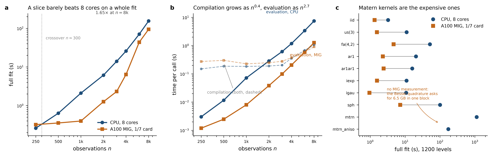

# Benchmarks

Two campaigns. Part 1 (2026-09-28) compares remlax with asreml at equal model on three axes, size, model complexity and density, on 4 CPU cores and on one A100. Part 2 (2026-09-01) measured the engine alone, CPU against a 1/7 MIG slice of the A100, across sizes and the structure catalogue; it is kept as it was.

## Part 1. Speed at equal model: asreml, remlax on CPU, remlax on one A100

Measured on 2026-09-28 and 2026-09-29, revision `9a51c79`, in the container
`ige_reml.sif` of the user's cluster (R 4.6.0, asreml 4.2.0.480, jax 0.11.1).
Script: `benchmarks/bench_complexite.R`. Tables and figures:
`benchmarks/summarise_benchc.py`, which writes `benchmarks/results/benchc_<date>_wide.md`
(one row per case, size and software; startup, compilation, solver, iterations,
evaluations, seconds per iteration and per evaluation, log-likelihood gap to
asreml), `benchc_<date>_table.csv` and five figures: `fig_benchc_wall.png`
(total time against n, one panel per model), `fig_benchc_density.png` (total
time against the number of genotypes at fixed n), `fig_benchc_iter.png` (time
per iteration), `fig_benchc_compile.png` (XLA compilation) and
`fig_benchc_breakdown.png` (startup, compilation and solver on the A100).

### What is measured

Each fit is the same model on the same simulated data for the three
programs. asreml is called once with `maxit = 100`. remlax is called with its
defaults (L-BFGS-B, then Newton polishing), `hessian = FALSE`, `blups = FALSE`,
so that the three programs do the same work: variance parameters, fixed
effects, log-likelihood. Times are wall-clock seconds of the complete call
from R.

For remlax the wall time is split in three. `startup` is the Python process,
the JAX and CUDA initialisation and the transfer of the model bundle; it is
5 to 15 s and does not depend on the model. `compile` is the XLA compilation
of the likelihood and its gradient; it is paid once per fit. `solver` is the
optimisation itself. asreml has no such split; its wall time is its solver
time.

Iterations are not comparable across programs. asreml counts average
information updates, each of which solves the mixed model equations once.
remlax counts L-BFGS-B iterations, each of which evaluates the likelihood and
its exact gradient one to several times in a line search; the polishing adds a
few finite-difference Hessians. The table therefore gives, for remlax, both
the number of iterations and the number of evaluations, and the time per
evaluation is the quantity that measures the cost of the algebra.

The log-likelihood gap is remlax minus asreml, in asreml's convention. A
positive gap means remlax reached a higher REML likelihood.

### The three axes

**Size.** n = 500, 2000, 8000, 16000, with 4 replicates per genotype, so that
q = n/4 genotypes (or n/(2t) for the multi-trait cases).

**Model complexity.** Ten models with 2 to 157 variance parameters: one
random factor (`iid`), the same with a dense genomic relationship matrix
(`grm`), an AR1 x AR1 field (`ar1ar1`), 3, 6, 9 and 12 traits with unstructured
genetic and residual covariances (`us3` to `us12`), 3 and 6 traits on a
genomic relationship matrix (`usK3`, `usK6`), and the model of chapter 3
(`ige`: direct and indirect genetic effects in a 2 x 2 unstructured block,
an indirect effect from the other species, an AR1 x AR1 random field and a
nugget).

**Density.** At n = 2000 and 8000, the number of replicates per genotype goes
from 40 to 1, so that q goes from n/40 to n, on the four cases where one
replicate is still estimable (`grm`, `usK3`, `usK6`, `ige`).

Sizes 32000 on the A100 and 16000 on CPU were attempted and are reported as
what they are (out of memory, over the time limit).

### Results

#### asreml is flat in n on classical designs; remlax is cubic in n

On `iid` asreml takes 5.1, 4.8, 5.6 and 5.8 s at n = 500, 2000, 8000 and
16000. On `us12`, with 157 parameters, 6.4 to 7.7 s. asreml solves the mixed
model equations, whose dimension is the number of effects q x t, with sparse
algebra; on these designs the number of observations barely matters.

remlax works on the dense n x n covariance matrix V. Each evaluation of the
likelihood is one Cholesky factorisation of V, an O(n^3) operation. The time
per evaluation shows it: on 4 CPU cores 0.018, 0.88 and 15 s at n = 500, 2000
and 8000; on the A100 0.0026, 0.017, 0.32 and 1.7 s at n = 500 to 16000. A
factor 4 on n costs a factor 6 to 50 on the evaluation. The consequence on
wall time: `iid` at n = 8000 takes 1026 s on CPU and 26 s on the A100 against
5.6 s for asreml; at n = 16000 the A100 takes 155 s against 5.8 s. On these
designs remlax is never faster than asreml, and on CPU it is 10 to 400 times
slower at n = 2000 already.

#### remlax's second cost is the number of evaluations

The time per iteration of remlax hardly depends on the number of variance
parameters (0.01 s at n = 500, 0.05 s at 2000, 2 to 5 s at 8000, 7 to 15 s
at 16000 on the A100). What grows with the number of parameters is the
number of evaluations: 25 to 60 for 2 to 4 parameters, about 90 for 13, 250
to 430 for 43, and several thousand for 91 and 157 parameters on small
samples (9363 evaluations for `us12` at n = 500, where 157 parameters are
fitted on 41 units). On large samples the surface is better conditioned and
the count falls (1008 evaluations for `us12` at n = 8000). asreml needs 6 to
161 average information iterations for the same models. A second-order
update, or a warm start from a smaller model, is the lever on this cost.

#### Where the problem is dense, remlax on the A100 overtakes asreml

Once the relationship matrix is dense or the incidence links genotypes to
each other, asreml's equations fill in and its cost grows with q. On `usK3`
and `usK6` at n = 16000 asreml takes 547 and 550 s, the A100 442 and 449 s. On
the model of chapter 3 the A100 is ahead from n = 2000: 13 s against 19 s at
n = 2000, 114 s against 816 s at n = 8000, 644 s against 5422 s at n = 16000,
with the same log-likelihood to 1e-6 (-13850.232858 against -13850.232859).

The density axis shows the mechanism. At n = 8000 on `grm`, asreml takes
4.4 s with 200 genotypes and 496 s with 8000 genotypes (one replicate); the
remlax solver on the A100 takes 7 to 32 s over the same range. On `ige` at
n = 8000, asreml takes 33 s with 201 genotypes, 222 s with 804, 816 s with
2009, 2040 s with 4018, and stops with one replicate on a singular average
information matrix (with an identity relationship matrix and one plot per
genotype, the direct genetic variance and the nugget are not separately
identified). The remlax solver takes 39 to 132 s over the same range; its
one-replicate fit is timed but its variance components carry the same
identification problem and are not a result. The A100 passes asreml between
q = 200 and 800 genotypes for `ige` at n = 8000, and between q = 2000 and
4000 for `grm`.

What makes the problem dense for asreml is the ratio of genotypes to
replicates, not n. A weighted neighbourhood incidence links every genotype
to the genotypes of its neighbours; in asreml it has no syntax of its own
and is passed through `grp()`, that is q dense covariate columns, treated as
dense regressors of size n x q. The design of chapter 3 (12760 observations,
neighbourhoods up to order 10, several hundred neighbours per plant) is a
strong case of this. For remlax none of this matters: V is n x n and dense
whatever the incidence, and a neighbourhood of order 10 costs the same
Cholesky as a neighbourhood of order 1.

#### Where the A100 time goes

Below n = 2000 the solver takes less than 1.5 s and the wall time (8 to
13 s) is startup and compilation. From n = 8000 the solver dominates on the
classical designs. On the cases with a relationship matrix, compilation
dominates at n = 8000: 300 s on `grm`, 404 s on `usK3`, 209 s on `usK6`, for
23 to 116 s of solver. The reason is that the relationship matrix and the
incidence matrices are captured as constants of the compiled program, and
XLA folds them. The density axis makes the pathology visible: at n = 8000 the
compilation of `grm` is 10 s with q = 200, 66 s with 800, 300 s with 2000,
then 14 s with 4000 and 23 s with 8000, when the constant exceeds the size
XLA is willing to fold. Passing K and Z as arguments of the compiled
program instead of constants is the fix; it would cut the wall time of these
cases by a factor 5 to 10 at n = 8000, and it is also what limited the size:
at n = 32000 the A100 refused an allocation of 41 GiB (five n x n matrices in
double precision, plus 2 GB of captured constants). The ceiling of the dense
formulation on an 80 GB card lies between n = 16000 and 32000.

#### The two stopping rules, and the log-likelihood gaps

asreml stops on a movement criterion: as documented in the ASReml-R manual,
convergence is declared when the REML log-likelihood changes by less than
0.002 times the iteration number and every variance component moves by less
than 1 %. It does not look at the
gradient. remlax stops on a slope criterion: L-BFGS-B runs to a relative
change of 1e-14 in -2 logL or a projected gradient below 1e-10, and the
Newton polishing then measures the decrement, the ascent still available
locally; the fit is declared at the optimum when the decrement is below 1e-4
and the relative gradient below 1e-6.

Over the 119 remlax fits paired with a successful asreml fit (CPU and GPU
counted separately), the gap is below 1e-4 in 106, and none is negative:
no remlax fit has a lower log-likelihood than the asreml fit it is paired
with (smallest gap 0.0 on values printed to 6 decimals). In five cases (ten
fits, the CPU and GPU fits agreeing), remlax is higher by more than 1e-3.
`benchmarks/verif_ecarts_asreml.R` refits asreml on the same data and
continues it with `update()` until its log-likelihood moves by less than 1e-6
or 40 updates (log `benchmarks/results/verif_ecarts_asreml_2026-09-29.log`,
values in `verif_ecarts_asreml.json`):

| case | n | genotypes | variance parameters | gap in the benchmark (asreml converge flag) | gap after continuing asreml |
|---|---|---|---|---|---|
| ige | 500 | 126 | 8 | -0.029 (FALSE) | -4e-8 after 4 updates (TRUE) |
| usK6 | 2000 | 8 | 43 | -0.033 (FALSE) | -0.0012 after 40 updates, still moving |
| us9 | 500 | 27 | 91 | -0.046 (TRUE) | -0.011 after 40 updates, still moving |
| us12 | 500 | 20 | 157 | -0.062 (FALSE) | -0.037 after 40 updates, still moving |
| us12 | 2000 | 83 | 157 | -1.339 (FALSE) | -1.30 after 40 updates, still moving |

The gap is asreml minus remlax. In four of the five cases asreml had not
declared convergence at `maxit = 100`; in the fifth (`us9`) it had, 0.046
below the top. In every case asreml moves toward remlax's value when it is
allowed to continue and never passes it; on `ige` it reaches it to 4e-8. The
gaps are therefore asreml's stopping, not a difference in the likelihood
being maximised. They concern heavily parameterised models on few
genotypes (8 to 83 genotypes for 43 to 157 parameters), where the average
information steps become small; on `us12` at n = 2000 asreml progresses by
about 1e-3 per update.

### Limits

- CPU remlax was not run beyond n = 8000, and three fits at n = 8000 were
  stopped at the 3 h limit (`us9`, `us12`, `usK6` with one replicate).
- CPU runs use 4 cores, except the density axis at n = 2000 (8 cores); the
  CPU scaling of remlax between 4 and 8 cores is below 20 %.
- One run per cell, no repetition; the wall times include the noise of a
  shared node (a few percent).
- asreml was called once with `maxit = 100`, as a user would; its `converge`
  flag is recorded in the CSV.
- lme4, sommer and nlme were compared for correctness in the validation but
  not timed here; lme4 does not express most of these models.

### What this means for the user of remlax

remlax does not compete with asreml on speed for classical designs at these
sizes, and on CPU it should not be used above a few thousand observations.
It is the tool when the model is dense in the sense above: many genotypes
and few replicates, a genomic relationship matrix, weighted neighbourhood
incidences, several traits on a relationship matrix; when the structure is
written as a function and differentiated exactly; when a GPU is available;
and when no asreml licence is. On the model of chapter 3 at the size of the
experiment, the A100 is 7 to 8 times faster than asreml on 4 cores.

## Part 2. The engine alone: CPU against a MIG slice (2026-09-01)

### What was measured, and on what

All timings come from one SLURM cluster, on 2026-09-01, inside the apptainer
image `ige_reml.sif` (JAX 0.11.1, NumPy 2.5.2,
Python 3.12.3).

| | CPU | GPU |
|---|---|---|
| hardware | AMD EPYC, **8 cores allotted** of a 192-core node | **one MIG slice** of an A100 80GB PCIe: 10 GB, 7 of 108 SMs |
| threads | `OMP_NUM_THREADS=8`, verified by probe (see below) | - |
| raw data | `benchmarks/results/bench_cpu_*_2026-09-01.csv` | `benchmarks/results/bench_a100-mig-1g10gb_2026-09-01.csv` |

The full card was occupied by other work and could not be measured. **Every GPU
number on this page is therefore a pessimistic bound**, not a property of the
hardware: a slice exposes one seventh of the multiprocessors while paying the
same compilation cost. The paper says so wherever these numbers appear.

#### A threading trap, and why it is documented rather than hidden

The first CPU run recorded `OMP_NUM_THREADS=1` inside the container although the
submission script exported 8, and achieved about 70 GFLOP/s on a dense
Cholesky - roughly two cores' worth of an eight-core allocation. SLURM's own
accounting put its CPU efficiency at 34.5%. `apptainer` does not pass a host
export into the container unless it is prefixed `APPTAINERENV_`.

The run was repeated with a probe that times one evaluation at n = 4000 under
each candidate setting and then runs the sweep under the fastest:

| setting | one evaluation at n = 4000 |
|---|---:|
| `OMP_NUM_THREADS=1` | 2.531 s |
| `OMP_NUM_THREADS=8` | **1.155 s** |

The single-thread figure matches the first run's 2.47 s to within 3%, which is
the direct evidence that it was effectively serial. Correcting it **halved the
apparent GPU advantage**: the per-evaluation ratio at n = 8000 fell from
14.2x to 5.9x. A benchmark whose baseline is accidentally serial does not
measure a solver, it measures a mistake.

### Growth in n

A single random factor plus an iid residual - the simplest model that exercises
the whole path. `fit` is a complete fit: initialisation, L-BFGS-B, Newton
polish. `eval` is one call of the objective and its gradient, compilation
excluded.

| n | fit CPU (s) | fit MIG (s) | gain | eval CPU (s) | eval MIG (s) | gain | iters |
|---:|---:|---:|---:|---:|---:|---:|---:|
| 250 | 0.2599 | 0.3212 | 0.81 | 0.0030 | 0.0012 | 2.53 | 7 |
| 500 | 0.6334 | 0.3546 | 1.79 | 0.0116 | 0.0025 | 4.70 | 7 |
| 1000 | 2.1016 | 0.3980 | 5.28 | 0.0720 | 0.0080 | 8.98 | 7 |
| 2000 | 6.1289 | 1.2601 | 4.86 | 0.2847 | 0.0383 | 7.43 | 7 |
| 3000 | 14.0239 | 2.3137 | 6.06 | 0.6156 | 0.0988 | 6.23 | 7 |
| 4000 | 25.8020 | 6.3897 | 4.04 | 1.1849 | 0.2055 | 5.77 | 7 |
| 6000 | 70.6511 | 43.7662 | 1.61 | 3.3975 | 0.5877 | 5.78 | 7 |
| 8000 | 154.9669 | 94.1949 | 1.65 | 7.4594 | 1.2664 | 5.89 | 7 |

Two facts to read alongside these columns. The **iteration count is 7 at every
n on both backends**, and the restricted log-likelihoods agree to the last
printed digit (max |dlogL| = 0). So no part of the table below is explained by
one backend converging differently from the other.

#### Three crossovers, not one

| definition | crossover |
|---|---|
| one objective call, compilation included | **n = 893** |
| one objective call, compilation amortised | below n = 250 - the slice wins at every size measured |
| a complete fit | **n = 301** |

#### Compilation is nearly flat, and repaid almost immediately

Fitted on the log-log grid: XLA compilation grows as **n^0.48** on the CPU and
**n^0.40** on the slice, against **n^2.65** and **n^2.73** for one evaluation.
So compilation is not strictly constant in n, but it is asymptotically
negligible - which is the sense that matters.

Its median cost is 0.197 s on the CPU and 0.301 s on the slice. The slice's
extra 0.104 s is repaid after **1.6 evaluations at n = 1000** and immediately
above that. This corrects an expectation worth stating plainly: compilation is
*not* what keeps the GPU from paying off at moderate n.

#### What does keep the slice from paying off

The per-evaluation ratio reaches 5.9x at n = 8000 while the whole-fit ratio is
only 1.65x, with the same 7 iterations on both sides. The gap is time the fit
spends outside objective evaluations, and it grows with n on the slice. That is
a measurement, not an explanation: the candidate causes - host-device
synchronisation at each L-BFGS-B iteration, transfer of the incidence matrices,
the spectral diagnostic - have not been separated, and profiling them is the
obvious next step rather than a conclusion to assert.

### Cost per structure of the catalogue

Fixed size, 1200 levels on a 40 x 30 grid, so the differences are the cost of
*building* V rather than of factorising it.

| structure | fit CPU (s) | fit MIG (s) | compile CPU (s) | params |
|---:|---:|---:|---:|---:|
| iid | 3.24 | 1.34 | 0.181 | 2 |
| us(3) | 11.02 | 1.55 | 0.241 | 9 |
| fa(4,2) | 51.49 | 4.67 | 0.255 | 15 |
| ar1 | 20.49 | 2.30 | 0.391 | 3 |
| ar1ar1 | 16.00 | 2.42 | 0.332 | 4 |
| iexp | 10.97 | 1.56 | 0.311 | 3 |
| igau | 10.71 | 0.95 | 0.269 | 3 |
| sph | 100.44 | 7.22 | 0.312 | 3 |
| mtrn | 1125.03 | OOM | -0.386 | 4 |
| mtrn_aniso | 172.99 | OOM | -0.450 | 6 |

The Matern kernels are the expensive ones, and on the slice they do not run at
all: the Bessel quadrature asks for a single 6.5 GB allocation, above what 10 GB
can give. They fit without difficulty on the CPU, and CPU/GPU parity does hold
for both at 160 levels (see [validation.md](validation.md)). This is a limit of
the slice, measured.



### What this means in practice

**These conclusions hold for models whose relationship matrix is the identity.**
Both suites above use a single genetic term with `LK=None`, and in that case
`term_factor` takes a branch that forms no product at all: `(L_Sigma (x) I)`
acts block by block. What is measured is therefore the Cholesky of V and the
*cheapest possible* assembly of V.

That is not the case that dominates runtime in practice. With a dense genomic
relationship matrix, each evaluation additionally pays

    ZL = Z (I (x) L_K)        n t q^2
    V += B B'                 n^2 m q

which at n = q = 4000 is about 80 Gflop of assembly against 21 Gflop for the
factorisation - the assembly dominates by roughly a factor of four. A covariance
shared between genetic terms (the direct/indirect shape, expressed here as one
term with t = 2 and a weighted neighbourhood incidence) multiplies that by t^2.
Both are dense matrix products, which is where a GPU is most favoured, so the
CPU/GPU balance below is expected to move - and the two suites `genomic` and
`crossterm` measure exactly that. **Until those numbers are in, read the guidance
below as applying to K = I only.**

1. **Below a few hundred observations, use the CPU.** A fit is a fraction of a
   second either way and the GPU adds a compilation to every new model shape.
2. **Between roughly 300 and a few thousand, the choice barely matters** on a
   MIG slice, for a model with K = I. It would matter on a full card, which was
   not measurable here.
3. **Above a few thousand, the GPU wins on arithmetic** - 5.9x per evaluation at
   n = 8000 - but only 1.65x on a whole fit on a slice, because of per-iteration
   overhead outside the objective.
4. **A one-seventh slice is close to not worth the detour** for a single fit
   with K = I. Its right use is running seven independent models, or seven
   restarts, at once - which is also how the `genomic` suite was measured.
5. **Avoid the Matern kernels on a small slice** and fit them on the CPU, or on
   a card with enough memory for the quadrature.

### Re-running the benchmarks

```sh
# CPU. The APPTAINERENV_ prefix is load-bearing inside a container.
APPTAINERENV_OMP_NUM_THREADS=8 APPTAINERENV_MKL_NUM_THREADS=8 \
  apptainer exec $SIF python3 benchmarks/bench.py --backend cpu --suite all \
  --ns 250,500,1000,2000,3000,4000,6000,8000 --reps 3 --reps-upto 4000 \
  --tag cpu-8c --out results/cpu.csv

# GPU
XLA_PYTHON_CLIENT_PREALLOCATE=false \
  apptainer exec --nv $SIF python3 benchmarks/bench.py --backend gpu --suite all \
  --nmax 12000 --tag a100-mig --out results/gpu.csv
```

`--suite` takes any subset of `scaling`, `compile`, `params`, `structures`.
Every measurement is printed as it is taken, so a job killed by a walltime still
yields its data through the log - which is how the first CPU run survived.
