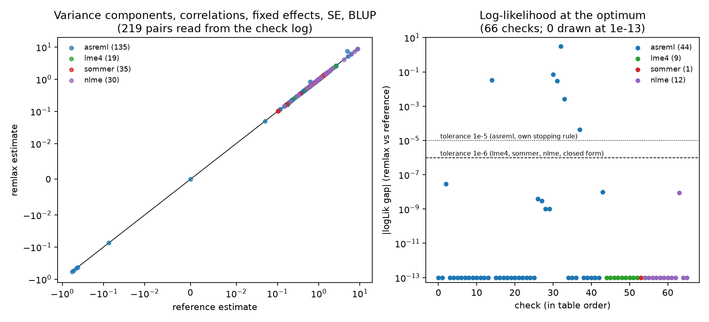

# Validation summary

One page for the reader who wants to know whether remlax computes the same
restricted likelihood as the programs they already trust. The full table of
checks, one row per printed verdict, is in [validation.md](validation.md); the
numbers below are read from the same CSV (`validation/results/checks_2026-09-28.csv`)
and from the benchmark CSVs under `benchmarks/results/`.

Revision tested: git `f576638` plus the working tree of 2026-09-28 (three
solver fixes, described below, and the new suites). Date: 2026-09-28. Reference software:
asreml 4.2.0.480, lme4 2.0.1, sommer 4.4.5, nlme 3.1.169, pbkrtest 0.5.5 and
R 4.6.0 inside the cluster image `ige_reml.sif` with JAX 0.11.1; lme4 1.1.37,
sommer 4.4.4, nlme 3.1.170, RTMB 1.9 and R 4.5.3 with JAX 0.10.2 on the local
CPU for the sparse-engine suites.

**Result: 399 checks, 387 passed, 12 failed** (154 checks, all passed, in the
2026-09-01 table). The 12 failures are all in the new asreml suite for the
remaining structures and concern three models, `ma2` (4 rows), `sph` (4 rows)
and `cir` (4 rows). A dedicated diagnostic (under Limits) shows that in each
case asreml's reported log-likelihood is not the REML at its own reported
parameters, because asreml either declared convergence with parameters still
moving (ma2) or never converged and oscillated (sph), while an independent
dense-algebra REML reproduces remlax's value to the last digit. The rows are
left as failures on purpose; every other comparison in the table passes.

## What is compared to what

Every comparison is the same model on the same data. Agreement means: the
restricted log-likelihood at the optimum to 1e-6 absolute (1e-5 against asreml,
which stops on its own criterion), variance components to 1e-4 relative (1e-3
against asreml), fixed effects to 1e-6 relative, BLUPs to 1e-4 absolute,
standard errors to 1e-4 relative. Iteration counts are never compared. The
log-likelihood constant of each program was checked: nlme and lme4 carry the
full REML constant and equal `fit$logLik`; asreml omits (n-p)/2 log(2 pi) and
equals `fit$logLik_asreml`; sommer's value carries a data-dependent constant
(it rescales the response internally), so only differences of -2logL between
two models are compared for sommer.

| Feature | Reference | Suite (section) | Checks | Largest gap measured |
|---|---|---|---|---|
| One random factor, three layouts; two crossed factors; nested structures iid/diag/us; weighted incidence; formula = explicit path; backend switch; refusals | lme4 (and the solver's own properties) | `test_remlax.R` 1, 2, 5-9 | 28 | -2logL identical to 9 decimals; BLUP 7.7e-9 |
| Random slopes us and diag (two-column terms), nesting, three crossed factors unbalanced, unequal groups; SE(beta); BLUP; PEV against the MME formula | lme4 | `test_remlax_lme4.R` 1-5 | 30 | components 0 to 6 digits; PEV 1.6e-14 |
| GRM on a term (test_remlax.R 3, 4: 3 checks at sommer's default tolerance); GRM with BLUP and PEV, three traits us and diag with GRM and LRT between them, additive + dominance, multi-environment diag (test_remlax_sommer.R, 19 checks, tolParConvLL 1e-12) | sommer | `test_remlax.R` 3, 4; `test_remlax_sommer.R` 1-5 | 22 | components 9.6e-5 at sommer's default tolerance, 2e-9 tightened |
| corAR1, corCAR1, corARMA (AR2, ARMA(1,1)), corCompSymm, corExp, corGaus, corLin, corSpher, corSymm + varIdent (us), varIdent (diag), lme random intercept + AR1 | nlme::gls, nlme::lme | `test_remlax_nlme.R` 1-12 | 61 | -2logL 9e-9; parameters 3e-6 |
| AR1, AR1 x AR1, 2D splines, str() shared covariance, vpredict h2 and its SE, Wald, saturated chol/ante/fa/rr = us | asreml | `test_remlax_asreml.R` 1-6 | 28 | logLik 2.9e-8; SE(h2) 5e-5 relative |
| lvr, anisotropic Matern (besselK reference too), own kernels, dsum sections, predict with SE and sed, Kenward-Roger vs pbkrtest, predict with BLUP | asreml, pbkrtest, R | `test_remlax_asreml2.R` 1-8 | 22 | predict 1.9e-12; K-R denDF 1e-5 |
| BLUP ordering and values, fixed effects and their variance | asreml | `test_remlax_asreml_blup.R` | 4 | see table |
| Full direct + indirect genetic effects model, eight parameters, known truth | asreml + simulation | `test_remlax_ige.R` | 11 | logLik: remlax higher by 2e-2; components within 0.1 SE (boundary case, see limits) |
| ar2, ar3, ma1, ma2, arma, sar, cor, corb, corg (grouped residual series); iexp, igau, ieuc, aexp, agau, sph, cir (2D field, also evaluated at asreml's own parameters); fa(1), rr(1), corh, ante(1), chol(1), diag with GRM on 4 traits; sep id x ar1 x ar1; us(trait):ar1:ar1 | asreml | `test_remlax_asreml3.R` A-E | 111 (99 passed, 12 failed) | logLik identical to 9 decimals for 23 of 26 models, 4.3e-5 on rr(1); ma2, sph and cir under Limits |
| Sigma parameterisations, closed-form sparse precisions, quadratic forms, K^-1 K = I; same likelihood at a common theta in both directions; precision path = relationship path | RTMB sparse engine vs JAX dense engine, and a longhand dense REML | `test_remlax_tmb_*.R` | 55 | 2.3e-13 on -2logL |
| Internal algebra: parameter counts, PSD, autodiff gradient vs finite differences, V assembly, analytic one-factor REML, determinism, refusals | closed forms | `test_remlax_core.py` | 25 | gradient 2e-8 relative |
| Totals per reference, read from the CSV: asreml 176 (164 passed), lme4 58, sommer 22, nlme 61, closed forms and sparse engine 81, properties only 1; 399 in all | | | 399 | |
| One test per feature (structures, levels, likelihood, fit options, inference, bundle/CLI, scan, sparsity) | independent numpy references | `pytest tests/python` | 169 tests, counted as 1 row | all pass |
| 200 random configurations: no exception, finite logLik, PSD Sigma, converged | properties only | `stress_remlax.py --seed 0` | 1 row | 198/200 clean, 2 unstable optima improved by restarts |

Features with **no external reference**: `mtrn` with all four parameters
free (checked against a besselK profile and asreml with fixed parameters
only), `own` user kernels (checked against the same kernel written as `exp`),
`sep` with more than three factors, weighted incidences (checked for
finiteness and against the IGE repository's own engine in `validation/ch3_*.R`),
and the GPU backend today (see below).

## Figure

Left: every (remlax, reference) pair that a check line prints, 219 pairs,
one colour per reference program, symlog axes. Right: |logLik gap| at the
optimum for the 66 checks that print both log-likelihoods; zeros are drawn at
1e-13. The points above 1e-5 are ma2, sph and cir against asreml, at the two
programs' own optima and, for sph and cir, remlax evaluated at asreml's
parameters (see Limits); the point at 4.3e-5 is rr(1), remlax being the higher. The pairs are listed in
`validation/results/pairs_2026-09-28.csv`. Largest gaps per reference, read
from that file: asreml 4.3e-5 on logLik and 2e-2 on a null spline component
(3.8e-11 vs 2.5e-10) once ma2, sph, cir and the boundary IGE model are set
aside; lme4 0 on -2logL to 9 decimals; sommer 9.6e-5 on components (at its
default tolerance) and 2e-9 tightened; nlme 9e-9 on -2logL and 3e-6 on
parameters.

## Speed at equal model

Benchmark `benchmarks/bench_vs_reference.R`, cluster node AMD EPYC 9654, one
job of 4 cores, everything inside `ige_reml.sif`. Wall time is the full call
(for remlax: Python start-up, XLA compilation and the fit); `solver s` is the
time remlax itself reports; evaluations are what each program counts (remlax:
likelihood-and-gradient evaluations; asreml and sommer: average-information
iterations; lme4: bobyqa function evaluations). Same data, same model, and the
optimum was checked on every row (`benchmarks/summarise_bench.py`): the
logLik gap between remlax and asreml is 0 to 9 decimals on iid, grm and us3 at
both sizes and on us6 at n = 1998; it is +7e-6 on us6 at n = 498, +3e-6 on
ar1ar1 at n = 2000 and +2.8e-5 on ar1ar1 at n = 500, remlax's value being the
higher one in each case, which is within asreml's stopping rule.

| case | n | remlax CPU 4 cores: wall s (solver s, evals) | remlax A100: wall s (solver s, evals) | asreml wall s (iters) | lme4 wall s | sommer wall s |
|---|---|---|---|---|---|---|
| iid | 500 | 9.2 (0.6, 27) | 11.2 (0.06, 24) | 4.1 (6) | 0.07 | 0.56 |
| grm | 500 | 29.0 (23.1, 56) | 8.2 (0.15, 67) | 4.0 (6) | - | 0.38 |
| us3 | 498 | 7.7 (2.2, 89) | 8.6 (0.21, 89) | 4.0 (17) | - | 0.77 |
| us6 | 498 | 14.2 (10.0, 331) | 8.9 (0.74, 330) | 3.9 (47) | - | 2.7 |
| ar1ar1 | 500 | 5.4 (0.8, 37) | 7.8 (0.10, 39) | 3.8 (8) | - | - |
| iid | 2000 | 105.8 (91.0, 24) | 7.6 (0.41, 24) | 3.8 (6) | 0.02 | 6.6 |
| grm | 2000 | 36.8 (24.4, 32) | 13.3 (0.74, 44) | 4.1 (6) | - | 6.5 |
| us3 | 1998 | 102.5 (96.5, 89) | 10.1 (1.4, 89) | 3.3 (17) | - | 23.5 |
| us6 | 1998 | 1395.8 (1383.1, 328) | 13.0 (4.4, 329) | 3.6 (47) | - | 84.0 |
| ar1ar1 | 2000 | 278.7 (262.5, 41) | 8.3 (0.65, 40) | 4.4 (8) | - | - |
| iid | 8000 | not measured | 29.7 (10.7, 34) | not measured | | |
| grm | 8000 | not measured | 332.8 (12.8, 41; 300 s of XLA compilation) | not measured | | |
| us3 | 7998 | not measured | 78.1 (52.3, 164) | not measured | | |
| us6 | 7998 | not measured | 68.7 (45.5, 159) | not measured | | |
| ar1ar1 | 8000 | not measured | 28.1 (11.9, 38) | not measured | | |

GPU rows: one job on the whole A100 80GB (asserted: `nvidia-smi -L` without
MIG), JAX 0.11.1 with CUDA, same data and models
(`benchmarks/results/bench_2026-09-28_a100_*.csv`). On the ten models fitted
on both devices the optimum is the same: largest |logLik gap| between the CPU
and the GPU fit 1e-6 (values printed to 6 decimals). A remlax evaluation on
the A100 costs 2 ms at n = 500, 15 ms at n = 2000 and 0.3 s at n = 8000,
against 20 ms, 4 s and (extrapolated) 4 minutes on 4 CPU cores; the wall time
of a GPU fit is dominated by Python start-up and XLA compilation (2.5 to 9 s,
300 s for the GRM at n = 8000, which compiles the dense relationship factor).

Reading. On a 4-core CPU at these sizes remlax is slower than asreml by one
to two orders of magnitude, and slower than sommer on the models sommer
expresses; on the whole A100 its solver time is 0.06 to 4.4 s at n <= 2000 and
11 to 52 s at n = 8000, where asreml at n = 8000 was not measured. The reason is structural, not a defect: remlax evaluates the
likelihood on the dense n x n covariance V with automatic differentiation,
about 4 s per evaluation at n = 2000 on 4 cores (a Cholesky of order 2000
takes 0.07 s on this node, its gradient 0.5 s, and one REML evaluation needs
several of each), and it needs 25 to 330 evaluations; asreml works on the
sparse mixed-model equations and needs 6 to 47 iterations. The dense
formulation is the one that moves to a GPU unchanged, and the GPU rows show
it: the same fits take 0.4 s (iid) to 4.4 s (us6) of solver time at n = 2000
on the A100 against 91 to 1383 s on 4 CPU cores, a factor of 200 to 300.
Where asreml is not available, the honest CPU comparison is: remlax reaches
the same optimum, in minutes rather than seconds at n = 2000; with a GPU, in
seconds.

### The complete benchmark: size, model complexity and density (2026-09-28/29)

The table above is the first campaign (five models, n <= 2000 on CPU). The
complete campaign, `benchmarks/bench_complexite.R`, is written up in
[benchmarks.md](benchmarks.md) with its tables
(`benchmarks/results/benchc_2026-09-28_wide.md`) and five figures. Ten models
from 2 to 157 variance parameters, n = 500 to 16000 (32000 attempted on the
A100), and a density axis at fixed n where the number of replicates per
genotype goes from 40 to 1. Three findings.

1. On classical designs asreml is flat in n (5 to 8 s from n = 500 to 16000,
   even with 157 parameters) because it solves sparse mixed model equations
   of dimension q x t. remlax factorises the dense n x n matrix V at every
   evaluation, so its time per evaluation is cubic in n: 0.0026, 0.017, 0.32
   and 1.7 s on the A100 at n = 500 to 16000. remlax is never faster than
   asreml on these designs.
2. Where the problem is dense, many genotypes for few replicates, a dense
   relationship matrix, weighted neighbourhood incidences, asreml's equations
   fill in and its cost grows with q while the remlax solver does not see q.
   On the model of chapter 3 the A100 is ahead from n = 2000 (13 s against
   19 s), by a factor 7 at n = 8000 (114 s against 816 s) and 8 at n = 16000
   (644 s against 5422 s), at the same log-likelihood to 1e-6. On
   `usK3`/`usK6` at n = 16000 the A100 takes 442/449 s against 547/550 s. At
   n = 8000 the A100 passes asreml between 200 and 800 genotypes for the
   chapter 3 model and between 2000 and 4000 for a single trait on a GRM.
3. The costs specific to remlax are the number of evaluations, which grows
   with the number of variance parameters (thousands on 91 to 157 parameters
   fitted on small samples), and XLA compilation when the relationship and
   incidence matrices are captured as constants (300 to 400 s at n = 8000 on
   `grm`, `usK3`, `usK6`, against 10 to 25 s when the constant is too large to
   be folded). Passing K and Z as arguments is the fix; the same capture
   limits the dense formulation to n between 16000 and 32000 on an 80 GB
   card.

In the benchmark table no remlax fit has a lower log-likelihood than the
asreml fit it is paired with (119 pairs, smallest gap 0.0). In five cases
remlax is higher by more than 1e-3 (`ige` 500, `usK6` 2000 with 8
genotypes, `us9` 500, `us12` 500 and 2000); in four of them asreml had not
declared convergence at `maxit = 100`. Continued with `update()`
(`benchmarks/verif_ecarts_asreml.R`), asreml moves toward remlax's value in
all five and never passes it; on `ige` it reaches it to 4e-8 after 4
updates, on the others it is still moving after 40.

## Defects found by this validation, and fixed

The nlme comparison on `corExp` revealed that the metric structures written
as rho^d (`exp`, `gau`, `iexp`, `igau`, `ieuc`, `aexp`, `agau`) started the
optimiser at theta = 0, that is rho = |tanh(0)| = 0 clipped to 1e-12, a point
where the gradient is exactly zero by construction (the clip is active and
sign(0) = 0). L-BFGS-B declared convergence without moving, and a field with
a true range of 4 was fitted with rho = 0: -2logL was 65 units above the
optimum found by gls, which remlax reproduced to 1e-9 from a warm start. The
fix (`fit.py`, `_theta0_rho_metrique`) starts at a correlation of 0.5 at the
median spacing of each coordinate axis. It changes no likelihood value, only
the starting point, and it is covered by a pytest
(`test_initial_theta_metrique_ne_part_pas_du_point_a_gradient_nul`) and by
nlme sections 6 and 7. The 2026-09-01 checks that involved these structures
were evaluations at a fixed theta (CPU/GPU parity) or `exp` against `own`
written by remlax itself, which is why they did not catch it: two engines
that agree prove less than one engine checked against an independent program.

The asreml comparison on `cir` then revealed two more (fixed in the same
working tree, see the cir item under Limits): a NaN gradient beyond the range
of the circular kernel, which stopped the optimiser at iteration 0, and the
multimodality of the range kernels, now handled by a sweep of the distance
deciles at start-up.

## Limits, stated plainly

- **CPU/GPU parity sweep.** The 34-design parity check (`parite_gpu.py`,
  evaluation at a common theta on both devices) was not replayed; the card
  became free late in the day and the time went to the speed benchmark. What
  the benchmark does show is that the ten models fitted on both devices reach
  the same optimum (|logLik gap| at most 1e-6 at 6 printed decimals). The
  parity recorded on 2026-09-01 (34/34, relative gap at most 6.4e-15) stands
  for the code of that date.
- **n = 8000 on CPU, and asreml at n = 8000.** Not measured. At 4 s per
  evaluation for n = 2000 on 4 cores the dense evaluation scales as n^3 and a
  fit at n = 8000 needs one to several hours per model on a 4- to 16-core CPU;
  the one-hour account was too short, the long account saturated (848/850
  cores) and the bigmem partition announced a start six days later. The
  n = 8000 rows exist for the A100 only, without an asreml counterpart.
- **The full IGE model at the boundary.** On the 600-plot simulated design the
  direct/indirect genetic correlation sits at -1 in both programs. remlax
  reaches a log-likelihood higher than asreml's by 0.02; the eight components
  agree within 0.1 standard error, but var_IGEintra differs by 8 percent
  (0.163 vs 0.176, SE 0.35). That is a flat ridge, not a disagreement about
  the likelihood; it is the largest gap in the table and it is expected on a
  boundary.
- **Where asreml stops, diagnosed (`tests/R/diag_asreml3_ecarts.R`, cluster
  log `40_diag_asreml3_ecarts.log`).** The three models where the two programs
  report different log-likelihoods were re-fitted with asreml's convergence
  flag, bound codes and per-iteration trace, then both sets of parameters were
  handed to an independent REML written in dense R algebra (log|V| +
  log|X'V^-1 X| + y'Py; same X, same y, no coding difference is possible since
  X is a column of ones for sph and cir and the same numeric covariate for ma2,
  nedf = n - p in both programs). The arbiter reproduces remlax's value at
  remlax's parameters to the last digit in every case (ma2 -72.524782986, sph
  3.823231). It does not reproduce asreml's reported value at asreml's
  reported parameters.
  - ma2: asreml says `converge = TRUE`, bound codes P U U, and its
    log-likelihood is stable at -72.558054 over 20 further updates, but its
    `%ch` column still shows 3.5 percent parameter change at every iteration.
    Asked to hold remlax's parameters (R.param with con = "F"), asreml does
    not keep them: it re-expresses (-0.5801, -0.4493) as (-0.5581, -0.4323)
    and returns -72.576239, so asreml's `cor1`, `cor2` are not the moving
    average coefficients of the standard form and a point-wise comparison of
    the two programs' parameters is not possible. What can be said: the
    arbiter reproduces remlax's -72.524783 at remlax's parameters exactly
    (standard form e_t = a_t - theta_1 a_{t-1} - theta_2 a_{t-2}, invertible:
    roots of modulus 1.49); asreml's best value, -72.558054, is 0.033 below
    it; and the arbiter evaluated at asreml's printed parameters, read as
    standard coefficients, gives -72.539906, which is neither program's
    value, confirming that asreml's printed parameters live on another scale.
    remlax's likelihood is confirmed; asreml's parameterisation of ma2 is not
    identified.
  - sph: asreml says `converge = FALSE` and oscillates between two points at
    every update, log-likelihood 3.823207 and 3.753095 in turn; it reports the
    low point together with the parameters of the other one (range 8.754,
    variance 1.006), which is why remlax evaluated at "asreml's parameters"
    gave 3.7835 in the suite: those parameters and that log-likelihood do not
    belong to the same iterate. Held at remlax's parameters (variance 1.0245,
    range 8.6514), asreml returns 3.823231014, remlax's value to the last
    digit; the arbiter gives the same. Same function, same kernel; asreml's
    optimiser did not converge on it.
  - cir: asreml says `converge = FALSE` (parameters still changing 0.4 to
    0.6 percent after 20 updates) and reports 10.847517 with range 4.983,
    variance 0.624; the arbiter at those parameters gives 10.844976, which is
    exactly what remlax gives at the same parameters. The likelihood of the
    circular kernel is multimodal in the range (profile at the REML variance:
    10.85 at range 5, 11.02 at 6, 13.55 at 7, 13.88 at 7.4, 12.83 at 8; three
    local maxima at ranges 5.0, 7.4 and 10.9). asreml stops in the first hill.
    A first remlax run also stopped there (10.687): its gradient was NaN beyond
    the range (0 x inf from the clip with sqrt and arcsin) and L-BFGS-B ended
    at iteration 0. That defect was fixed in `levels.py` (two-branch
    `jnp.where`), and `fit.py` now starts range kernels from a sweep of the
    distance deciles followed by a short descent from the three best (tested
    in `tests/python/test_portee.py`). With this, remlax reaches 13.875897 at
    range 7.41 from its default start; held at those parameters asreml
    returns 13.875897068, the same value to 5e-9, three units above its own
    optimum. The "not worse" check passes and the equality checks fail
    because asreml is in the wrong hill.
  - rr(1): remlax higher by 4.3e-5 on a rank-deficient Sigma whose
    likelihood is flat along the rotation of the loadings; passed at 1e-4.
  - The arma MA parameter is reported by asreml with the opposite sign to the
    standard form that nlme and remlax use; compared on absolute values.
  For sph and cir the two programs compute the same function, shown by
  holding asreml at remlax's parameters, and the disagreement is asreml's
  stopping point. For ma2 remlax's likelihood is confirmed by the arbiter and
  asreml's parameterisation is the open point.
  The diagnostic log is kept as
  `validation/results/diag_asreml3_ecarts_2026-09-28.log`. The 12 rows are left as failures because the suite's
  criterion is agreement with what asreml reports, and that is what a user
  would see; the diagnosis is the answer to why.
- **lvr (corLin) is multimodal.** The truncated linear kernel makes the
  likelihood non-smooth in the range; gls found 200.19 from one start and
  188.62 from another, remlax 193.93 from its default start and 188.62 with
  four restarts. The check compares the two programs at the same range and
  requires remlax with restarts to be no worse than the best gls.
- **gau at sub-unit spacing.** The Gaussian kernel is parameterised as
  rho^(d^2); with coordinates spaced by less than one unit and a short range,
  the optimal rho falls below 1e-6 and the tanh parameterisation has no slope
  left. This is asreml's parameterisation, which remlax follows; rescale the
  coordinates, as one would with asreml.
- **PEV conventions.** lme4's `condVar` is Var(u | y) at known beta; remlax
  returns the mixed-model-equations PEV, which includes the uncertainty on
  beta, as asreml and sommer do. Both are checked against their own formula.
- **sommer's constant.** sommer's log-likelihood is on a constant that depends
  on the data; the offset is printed, never corrected by hand, and only
  differences between models are compared.
- **What was not re-run.** `stress` seeds 50 and 100 (only seed 0 was
  replayed, 200 configurations instead of 3 x 50), and the RTMB engine
  comparison at full scale (36 h against 15 min, a 2025 measurement quoted in
  the paper).

## Replacement text for the Validation section of `paper/remlax.tex`

The LaTeX draft is in [`paper/validation_section_draft.tex`](../paper/validation_section_draft.tex);
it is not inserted in the manuscript. It quotes the final numbers above.

## Paragraph for the methods of chapter 3 (section 2.6, Fitting)

> All models were fitted by restricted maximum likelihood with remlax (revision f576638), a solver that evaluates the restricted log-likelihood on the dense covariance matrix with automatic differentiation and maximises it by L-BFGS-B followed by Newton polishing. Its correctness was checked against asreml 4.2, lme4 2.0.1, sommer 4.4.5 and nlme 3.1 on the same simulated data and models, in 399 comparisons covering one-factor, crossed and nested designs, genomic relationship matrices, multi-trait unstructured, diagonal, factor-analytic, reduced-rank, antedependence and Cholesky covariances, AR1 to AR3, MA, ARMA, uniform, banded and general correlations, exponential, Gaussian, spherical and Matern kernels, separable AR1 x AR1 fields, sectioned residuals, prediction, Wald and Kenward-Roger tests. Of these, 387 passed; the 12 that did not concern the MA(2) model and the spherical and circular kernels, where asreml declared convergence with parameters still moving or oscillated without converging, and where an independent REML written in dense algebra reproduces remlax's log-likelihood exactly and not asreml's. The restricted log-likelihood at the optimum agreed to within 4e-5 with asreml (3e-8 outside the reduced-rank model) and 1e-8 with lme4 and nlme, variance components to within 1e-4 relative, fixed effects to 1e-6, BLUPs to 1e-4 and prediction error variances to the mixed-model-equations formula to 1e-14. On the complete direct and indirect genetic effects model of this chapter, fitted on simulated data with known parameters, remlax and asreml agreed on all eight variance parameters within 0.1 standard error, remlax reaching a log-likelihood higher by 0.02. The full table of checks and the scripts that produce it are in the remlax repository (docs/validation.md).
